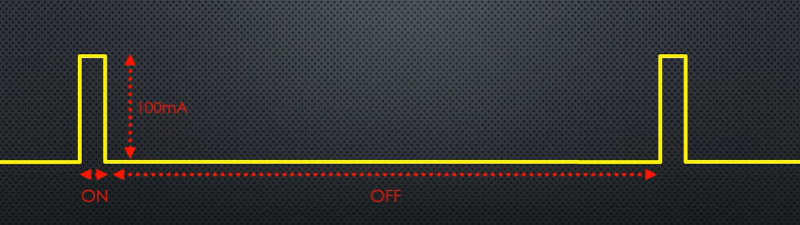
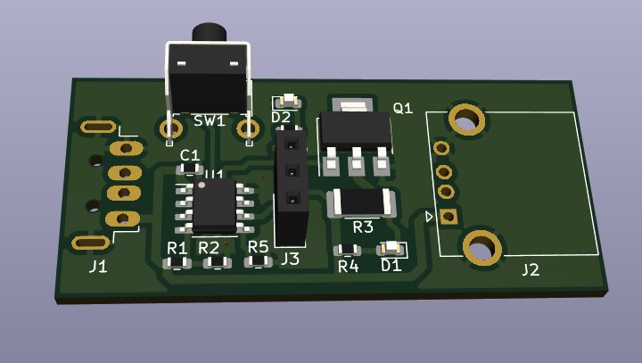

# Keep powerbank on

>This project is based on ideas from [Andreas Spiess YouTube video ](https://www.youtube.com/watch?v=SgV6_Y_sg4k&t=782s&ab_channel=AndreasSpiess)

The main idea is to keep powerbank on if her load is less than powerbank on threshold.
Every powerbank detect drawn current if current is less than cca 5mA the powebank enable timeout for switch off.
The tool is trying to catch the maximum power off timeout and connect some load before timeout. It will postpone (reset) automatic power off.

Example with load connection:

## PCB
Was designed in KiCad... see folder [folder](PCB)

## How to use the tool
1. **Learning mode**
  press the button and connect powerbank. The GREEN led will blink 3times that means the powerbank is in learning mode. The tool is waiting until the powerbank will be automatically powered off. This time is stored in internal eeprom.
2. **Working mode**  
 switch on or Reconnect the powerbank. If tool correctly stored a power off time in step one and this time is bigger than 1 second, the GREEN led will be ON for 5 seconds.
  If learning process failed, the GREEN and RED leds blinks 3 times and tool is automatically switched to 1st point - learning mode.
